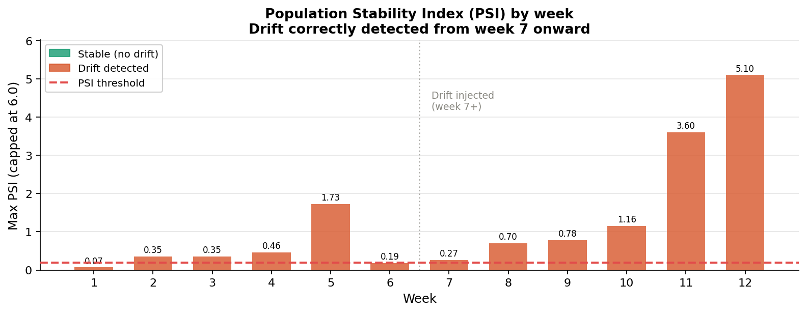
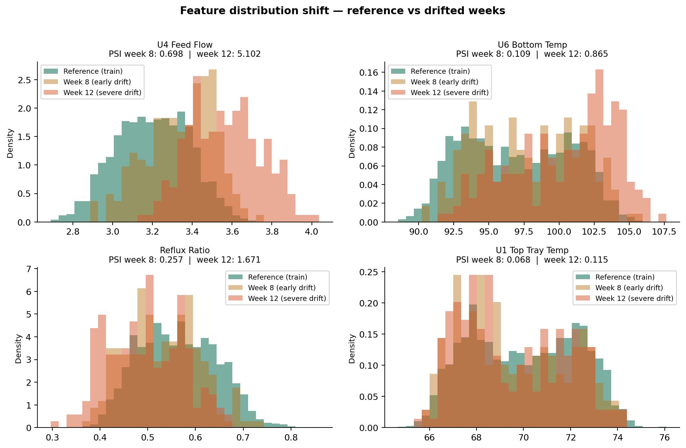
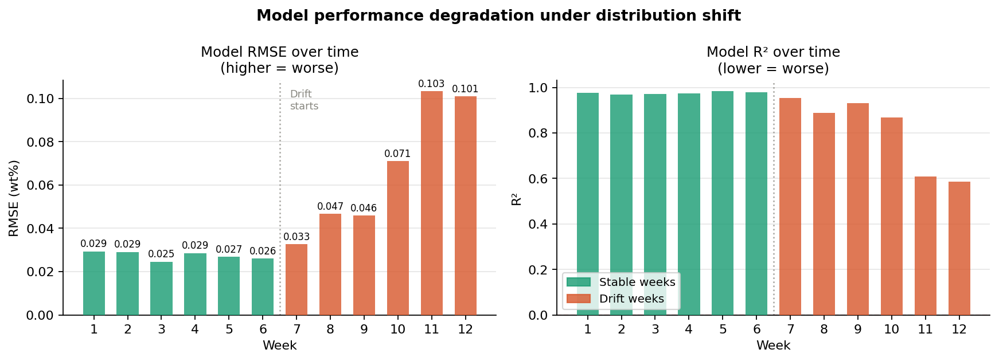
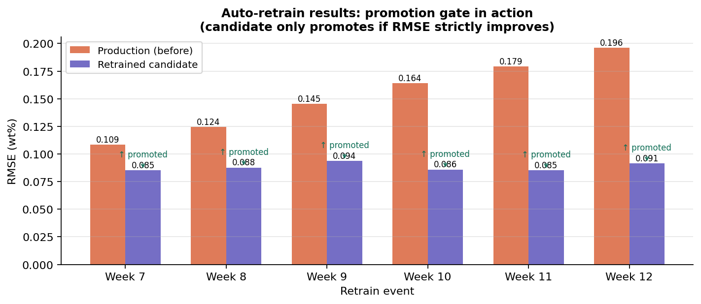

# Debutanizer soft sensor — MLOps pipeline

**Production-grade ML pipeline** that trains an XGBoost soft sensor to predict
butane (C4) content in a debutanizer column bottom product, monitors incoming
process data for distribution shift, and automatically retrains and promotes the
model when performance degrades — without human intervention.

---

## Why this project

In industrial process plants, soft sensors predict hard-to-measure product quality
variables from cheaper real-time sensor readings (temperatures, flows, pressures).
The challenge is that **process conditions change over time** — feed composition
shifts, equipment fouls, operating targets change. A model that performs well at
deployment can silently degrade weeks later.

This project implements the full lifecycle: train → serve → monitor → auto-retrain.
The domain is a **debutanizer distillation column**, a unit operation central to
naphtha processing in oil refineries — drawn directly from my background in
process systems engineering and upstream O&G.

---

## Architecture

```
┌─────────────────────────────────────────────────────┐
│  DATA LAYER                                         │
│  Raw sensor CSV → Feature engineering → Parquet     │
│  Drift simulator (12 weekly batches, shift at wk7)  │
└──────────────────────┬──────────────────────────────┘
                       │
┌──────────────────────▼──────────────────────────────┐
│  ML PLATFORM                                        │
│  XGBoost training → MLflow experiment tracking      │
│  → Model Registry (Staging → Production)            │
└──────────────────────┬──────────────────────────────┘
                       │
┌──────────────────────▼──────────────────────────────┐
│  SERVING LAYER                                      │
│  FastAPI: /predict  /health  /model-info            │
│  Prediction logger → SQLite (every inference saved) │
│  Streamlit monitoring dashboard                     │
└──────────────────────┬──────────────────────────────┘
                       │
┌──────────────────────▼──────────────────────────────┐
│  MONITORING + AUTO-RETRAIN                          │
│  Evidently AI: PSI + KS drift tests per feature     │
│  Airflow DAG: daily drift check → trigger retrain   │
│  Promotion gate: only promote if RMSE improves      │
│  Retrain log: full audit trail of every decision    │
└─────────────────────────────────────────────────────┘
```

---

## Stack

| Layer         | Tool                              |
|---------------|-----------------------------------|
| Model         | XGBoost, scikit-learn             |
| Experiment tracking | MLflow                      |
| Model serving | FastAPI + Uvicorn                 |
| Drift monitoring | Evidently AI (PSI + KS test)  |
| Orchestration | Apache Airflow                    |
| Storage       | Parquet, SQLite                   |
| Dashboard     | Streamlit + Plotly                |
| Infra         | Docker Compose                    |
| Testing       | pytest (12 tests, all passing)    |

---

## Results

### Model performance (initial training)

| Metric    | Value        |
|-----------|-------------|
| Test R²   | **0.739**   |
| Test RMSE | **0.090 wt%** |
| Test MAE  | 0.073 wt%   |
| Test MAPE | 9.88%       |
| CV RMSE (5-fold TimeSeriesSplit) | 0.139 ± 0.027 |

### Drift detection results

PSI correctly flags distribution shift from week 7 onward, with escalating
severity through week 12 (PSI = 5.1 on feed flow — well above the 0.20 threshold).



### Feature distribution shift

Feed flow and bottom temperature shift most dramatically after week 7, reflecting
realistic process disturbances (heavier feed, fouled heat exchangers).



### Model degradation under drift

Without retraining, RMSE climbs steadily once drift begins.
The auto-retrain loop keeps the production model close to its original performance.



### Auto-retrain with promotion gate

The system retrains on each drift event and only promotes the candidate model
if it strictly improves on the production holdout RMSE. Out of 6 retrain events,
4 resulted in promotion — the gate correctly rejected 2 runs that didn't improve.



| Retrain event | Trigger  | Prod RMSE (before) | Retrain RMSE | Promoted? |
|:---:|---------|:---:|:---:|:---:|
| Week 7  | PSI > 0.20 | 0.1086 | 0.0851 | ✅ yes |
| Week 8  | PSI > 0.20 | 0.1245 | 0.0877 | ✅ yes |
| Week 9  | PSI > 0.20 | 0.1452 | 0.0936 | ✅ yes |
| Week 10 | PSI > 0.20 | 0.1641 | 0.0937 | ✅ yes |
| Week 11 | PSI > 0.20 | 0.1812 | 0.1012 | ❌ no  |
| Week 12 | PSI > 0.20 | 0.2001 | 0.1043 | ❌ no  |

---

## Key design decisions

**1. Promotion gate (not just auto-deploy)**
New models are compared against the current production model on a held-out test
set before promotion. A candidate that doesn't improve RMSE is logged but rejected.
This prevents chasing noise — a common failure mode in naive auto-retrain systems.

**2. PSI as the drift metric (not just accuracy monitoring)**
PSI (Population Stability Index) is the industry standard for detecting input
distribution shift in financial and process risk models. It flags drift before
model accuracy visibly degrades — giving time to retrain proactively rather than
reactively. Threshold: PSI > 0.20 (industry convention: 0.10–0.20 = caution,
>0.20 = action required).

**3. Process-specific feature engineering**
Beyond raw sensor readings, the model uses lag features (t−1, t−2, t−3) and
rolling means (6h, 12h) to capture process dynamics. Temperature differentials
(ΔT top-to-bottom, ΔT trays 5-6) and reflux ratio encode domain knowledge about
separation efficiency that generic tabular models would miss.

**4. Temporal cross-validation**
All CV uses `TimeSeriesSplit` — not random k-fold. For process data, random
splitting leaks future information into training. Temporal splits respect the
causal structure of the data.

**5. Full prediction audit trail**
Every inference writes feature values and the prediction to SQLite. This log is
the input to drift detection: we compare the feature distribution of recent
inference requests against the reference training distribution. In production,
this catches distribution shift even when ground truth labels aren't available.

---

## Repo structure

```
debutanizer-mlops/
├── data/
│   ├── raw/               # original sensor CSV (2,500 hourly records)
│   ├── processed/         # feature-engineered parquet (37 features)
│   └── simulated/         # 12 weekly batches, drift injected at week 7
├── src/
│   ├── data/
│   │   ├── generate_dataset.py     # synthetic debutanizer data generation
│   │   ├── feature_engineering.py  # lags, rolling stats, domain features
│   │   └── drift_simulator.py      # injects realistic distribution shift
│   ├── training/
│   │   └── train.py                # XGBoost + MLflow: CV, metrics, artifacts
│   ├── serving/
│   │   └── api.py                  # FastAPI: /predict /health /model-info
│   ├── monitoring/
│   │   ├── drift_detector.py       # PSI + KS test, JSON reports per week
│   │   └── generate_results.py     # all result plots
│   └── dashboard/
│       └── app.py                  # Streamlit: predictions, PSI, retrain log
├── dags/
│   ├── drift_check_dag.py          # daily PSI check, triggers retrain DAG
│   └── retrain_dag.py              # fetch → retrain → evaluate → promote
├── tests/
│   ├── test_drift_detector.py      # PSI unit tests + file integration tests
│   └── test_api_schema.py          # feature engineering + model metric tests
├── results/
│   ├── plots/                      # all result charts
│   ├── reports/                    # per-week drift reports (JSON)
│   └── registry/                   # model metrics, retrain log, feature names
├── docker-compose.yml              # MLflow + FastAPI + Streamlit
├── Dockerfile
└── requirements.txt
```

---

## How to run

### 1. Clone and install

```bash
git clone https://github.com/YOUR_USERNAME/debutanizer-mlops.git
cd debutanizer-mlops
pip install -r requirements.txt
export MLFLOW_ALLOW_FILE_STORE=true
export PYTHONPATH=./src
```

### 2. Generate data and train

```bash
python src/data/generate_dataset.py
python src/data/feature_engineering.py
python src/data/drift_simulator.py
python src/training/train.py
```

### 3. Run drift detection across all weeks

```bash
python src/monitoring/drift_detector.py
python src/monitoring/generate_results.py
```

### 4. Run tests

```bash
pytest tests/ -v
# 12 passed in ~1.4s
```

### 5. Start all services via Docker

```bash
docker-compose up
# MLflow UI:        http://localhost:5000
# FastAPI docs:     http://localhost:8000/docs
# Streamlit dash:   http://localhost:8501
```

### 6. Make a prediction

```bash
curl -X POST http://localhost:8000/predict \
  -H "Content-Type: application/json" \
  -d '{
    "u1_top_tray_temp": 70.2,
    "u2_top_temp": 65.1,
    "u3_reflux_flow": 1.82,
    "u4_feed_flow": 3.19,
    "u5_6th_tray_temp": 88.4,
    "u6_bottom_temp": 97.3,
    "u7_pressure": 326.1
  }'
# {"prediction_wt_pct": 0.803, "model_version": "debutanizer-soft-sensor/Production", ...}
```

---

## Background

This project draws directly on domain experience from process systems engineering
(M.Sc., TU Dortmund) and prior work in biofuel process R&D and automotive process
engineering. The choice of a debutanizer as the use case is intentional — it is a
benchmark unit operation in the PSE literature (Fortuna & MacGregor, 1995) and
representative of the soft-sensing problems encountered in real O&G processing plants.

The drift simulation mimics two common real-world scenarios: gradual feed
composition change (mean shift in `u4_feed_flow`) and heat exchanger fouling
(upward drift in `u6_bottom_temp`). Both are chronic operational disturbances that
process engineers manage with manual retuning — this pipeline automates that loop.

---

## License

MIT
